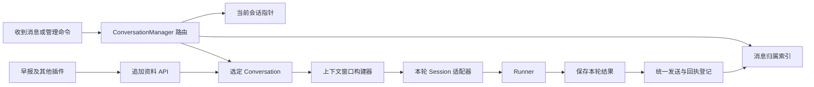

# Sunny Agent 统一上下文管理设计

状态：核心方案已实现。群聊采用用户已确认的「全群共享当前会话」。运行接口、配置及首次上线限制见 [context-api.md](context-api.md)。

实现说明：命令在 `conversation_chat.py` 统一分发；消息与条目的关联暂存为经过同会话校验的 ID 数组，无独立关联表。引用会附加有界的单条快照以保留明确指向。历史摘要、自动清理和旧进程内存导出属于后续扩展，未在本次实现。

后续扩展：已接入 LLM 自动命名，以及 `list_sessions` / `read_session` 只读工具。Sunny 可分页列出、分段读取同一 Scope 内的其他会话；查询不切换当前会话。下文的 `/quote` 和 `read_context` 仍保持原有范围限制，主动查阅其他会话通过独立的 `read_session` 完成，具体行为以运行接口文档为准。

## 1. 用户行为

同一个群或私聊可以有多个会话，同时有且只有一个当前会话。新建会话保留旧会话；引用消息用于找到会话，后续普通消息继续使用选中的会话。

| 操作 | 本次使用的会话 | 对当前会话的影响 |
| --- | --- | --- |
| 普通消息 | 当前会话；尚不存在则创建 | 保持 |
| `/new`、兼容命令 `/clear`、群内戳机器人 | 新建空会话 | 切换到新会话 |
| 引用已登记的历史消息并提问 | 被引用消息所属会话 | 切换到该会话 |
| 引用历史消息，发送 `/quote 问题` | 当前会话，附带所选消息的内容 | 保持 |
| 引用历史消息，发送 `/session use` | 被引用消息所属会话，仅切换 | 切换；不调用模型 |
| `/session use <短编号>` | 指定会话，仅切换 | 切换；不调用模型 |
| `/session current`、`/session list` | 查询当前会话或本聊天最近会话 | 保持；不调用模型 |
| 引用未登记的消息 | 能验证本聊天来源时，作为引用资料交给当前会话 | 保持，并提示未找到历史会话 |
| 定时早报、`/rss today` | 早报专属会话 | 默认保持；引用早报后才切换 |

新建成功提示：「已新建会话 #K7Q2。引用旧消息可以继续之前的会话。」切换时只提示一次：「已切换到 #P3M8。」普通回复无需重复显示编号。确认消息也登记为目标会话的入口，但不写入模型历史。

群成员共享会话内容和当前会话指针。任何能使用现有聊天功能的群成员均可新建或切换。私聊的指针与所有群聊隔离。

引用旧消息意味着**继续这个会话的最新进度**，不是回滚到被引用消息的时刻。未来如需分支，再添加 `/session fork`，不要复用普通引用的语义。

## 2. 现有代码与缺口

| 位置 | 当前行为 | 改造方向 |
| --- | --- | --- |
| `event.py` | `/clear` 和戳一戳调用删除历史；回复由 `llm.finish(message)` 发送 | 改为新建会话；发送后获取消息 ID 并登记 |
| `chat.py::_get_referenced_message` | 读取 `event.reply`，必要时调用 `get_msg` | 将引用解析结果同时交给路由器与输入构建器，避免重复查询 |
| `chat.py::_build_agent_input` | 所有引用都拼到当前输入 | 根据 resume / quote 和窗口中已有内容组装输入 |
| `graph.py` | 固定使用 `group:<group_id>` / `private:<user_id>` | 由管理器传入已选定的会话，模型层不再选择会话 |
| `graph.py::_get_session` | `SQLiteSession(session_id)` 未指定文件 | 当前安装版本默认使用内存库；新增持久化存储 |
| `limited_messages.py` | 空壳 | 上下文窗口策略放到统一构建器，避免另起一套管理逻辑 |
| `commands/rss_command.py` | RSS 命令入口 | 继续调用公共发布服务 |
| `rss_daily.py` | 实际发送正文、合并转发和点评；底层只返回 bool | 返回完整发送回执；正文资料和消息入口统一登记 |
| `tool.py` | 图片和私信工具会绕过主回复路径直接发送 | 将当前会话和发送服务注入 `ChatContext` |

当前代码没有保存历史 QQ 消息与 SDK item 的映射，已有消息不能凭内容或时间可靠地反推会话。首次上线前的消息按「未知归属」处理。

## 3. 核心模型

拆开三个概念：聊天范围 Scope、会话 Conversation、上下文条目 ContextEntry。QQ 消息是条目的展示入口，条目可以没有 QQ 消息，也可以由多个消息展示。



### Scope：隔离边界

建议键为 `(adapter, bot_id, chat_type, peer_id)`，例如 `onebot.v11 / 123 / group / 456`。机器人账号、群和私聊均隔离；`message_id` 统一转字符串，只能在完整 Scope 内查询，不能当全局主键。

「跨会话引用」仅指同一 Scope 内的引用。向另一个群或私聊发送内容时，只在目标 Scope 登记实际发送的内容，不将源会话历史迁移过去。

### Conversation：可恢复的会话

每个会话有内部 UUID、Scope 内唯一短编号、标题、创建来源与时间。短编号用于用户操作；冲突时重新生成，不能只截取 UUID 就假定唯一。

会话是否为「当前」由独立指针表示，不在多个会话上维护 active 布尔值。`create_session(activate=True)` 在一个数据库事务内创建会话并更新指针；旧会话保持可用。

### ContextEntry：消息以外的上下文

条目至少区分 `turn`（完整对话轮次）、`external`（早报、文档、插件数据）、`assistant_publication`（主动点评等）、`summary`（后续扩展）。保留来源、时间、作者、内容块和幂等键。一个 turn 保留 SDK 原生 input/output items，包括工具调用及结果。

外部资料以带来源说明的低优先级数据块投影到模型输入，例如 user-role 的 `<context_data>`。不能作为 system/developer 指令，不能伪造真人发言或成功的工具调用；网页正文中的指令仍然是资料。

机器人主动生成的点评可作为 assistant 内容。RSS 原文即使通过机器人账号发送，仍然属于 external。持久化元数据不直接塞入 SDK item 的任意字段，由输入构建器转换为合法输入。

## 4. 引用路由及跨会话引用

处理顺序固定为：解析消息和引用 → 处理管理命令 → 查消息归属 → 决定会话 → 构建模型输入。路由由程序执行，不让模型猜测用户要切换还是引用。

1. 优先读取 `event.reply.message_id`，兼容剩余 CQ reply 段。已安装的 OneBot adapter 可能将 reply 段移除后存入 `event.reply`，不能只扫描 `event.message`。
2. `/new`、`/clear` 优先于引用，即使命令引用旧消息也创建新会话。
3. `/quote` 强制保留当前会话；没有引用对象时返回用法提示，不把 `/quote` 当普通文本送模型。
4. 普通引用命中本 Scope 的绑定，则切换；引用本会话消息无需重复提示。无文本、无图片的纯引用只切换并确认，不调用模型。
5. 没有引用，使用当前指针；首次聊天懒创建。
6. 未知归属、目标不存在、跨 Scope、会话已被清理分别返回明确结果。失败不能悄悄切到另一个会话。

`/quote` 去除命令前缀，保留本次问题、图片以及被引用消息的内容快照。它只带入所选消息的可见内容；合并转发容器带入该容器对应的节点内容，不自动带入源会话其他历史。

例如当前是 B，引用 A 中「预算为 500 元」并发送 `/quote 按这个预算调整我们刚才的方案`：模型收到 B 的上下文、预算引用和问题；生成的用户输入及机器人回答都归 B。被引用原消息仍归 A，以后引用它仍切回 A。保存引用来源关系及快照，但不修改原消息归属，不递归展开引用链。

普通 resume 模式也需要知道用户指向哪条消息。若该消息已在本轮上下文窗口中，只附加定位信息；若已被窗口裁掉，则补入该消息快照。不能仅切换会话却丢失「这一条」的指向，也不要重复灌入整段历史。

未知消息只有在已有本 Scope 接收记录，或底层返回的群/私聊身份足以验证来源时，才允许提取内容作为引用。`get_msg` 成功、message_type 相同都不能单独证明属于本群。来源无法验证时只提示无法读取；明确 `/session use` 失败则不调用模型。可选增加轻量消息观察器，记录未触发聊天消息的 Scope 和 ID，不把普通群聊内容自动送进模型。

触发规则同时调整：`to_me`、主动接收开启、或引用命中本 Scope 已登记会话消息时触发。这样引用之前的用户消息也可以切换，不要求再 @ 机器人。未知消息仍遵循现有 `to_me` / 主动接收规则，避免接管群友之间的普通引用。识别命令时跳过 reply、机器人 at 和前导空白；管理命令交给高优先级 matcher，避免 `/quote` 被当前「所有斜杠命令直接结束」逻辑吞掉。

## 5. 对内 API

以下是拟新增的业务接口，不是现有 SDK API。建议在 `context/__init__.py` 导出稳定入口；只有管理器可以选择或修改当前会话，内容 API 始终显式接收 `ConversationRef`。

```python
@dataclass(frozen=True)
class Scope:
    adapter: str
    bot_id: str
    chat_type: Literal["group", "private"]
    peer_id: str

@dataclass(frozen=True)
class ConversationRef:
    scope: Scope
    conversation_id: str

async def create_session(
    scope: Scope, *, activate: bool = True,
    title: str | None = None, source_key: str | None = None,
    idempotency_key: str,
) -> ConversationRef: ...

async def get_active_session(scope: Scope) -> ConversationRef: ...

async def switch_session(conversation: ConversationRef) -> None: ...

async def append_context(
    conversation: ConversationRef, *, content: ContextContent,
    kind: Literal["external", "assistant_publication"],
    source: SourceInfo, idempotency_key: str,
) -> EntryRef: ...

async def bind_message(
    conversation: ConversationRef, *, receipt: MessageReceipt,
    entries: Sequence[EntryRef], visible_content: ContextContent,
) -> None: ...

async def send_in_session(
    conversation: ConversationRef, *, outgoing: OutgoingMessage,
    entries: Sequence[EntryRef], idempotency_key: str,
) -> DeliveryResult: ...
```

`ContextContent` 是文本、结构化数据、图片/文件引用等内容块的序列；结构化数据投影为有界 JSON 文本。`SourceInfo` 包含来源类型、稳定来源 ID、标题、URL、时间及版本。API 不依赖 NoneBot event，也不要求伪造用户消息。

`MessageReceipt` 包含实际 adapter / bot / chat、message_id、发送时间。`DeliveryResult` 包含 confirmed / failed / unknown 状态和已有回执，不能仅返回 bool。成功但没有普通消息 ID 时，记录「已发送但不可引用」，不得把合并转发的资源 ID 冒充 message_id。

`append_context` 只追加内容，不调用模型、不发送消息、不改变当前指针。`bind_message` 只登记入口，不重复追加历史。`send_in_session` 先持久化待发送任务，再调用传输层，成功后保存回执与入口；对应内容必须已追加或已经由本轮 Runner 提交。对话模型生成的最终回复已经存在于 turn 中，发送时只绑定，不能再手工追加一次 assistant 消息。

相同幂等键和相同内容返回已有结果；相同键而内容不同报冲突。幂等重放不再次更新当前指针，否则旧命令重投可能覆盖用户后来的切换。`source_key` 在 Scope 内唯一，用于找回同一批早报的会话；内容版本变化必须有新的条目幂等键。全新会话命令的幂等键来自收到的事件，不能固定为 `new:<scope>`。

纯数据接入示例：

```python
conversation = await manager.get_active_session(scope)
await manager.append_context(
    conversation,
    content=ContextContent.text(project_status_json),
    kind="external",
    source=SourceInfo(kind="plugin", source_id="project-status"),
    idempotency_key=f"project-status:{revision}",
)
```

这里获取到的是确定的会话引用；即使之后发生切换，本次写入仍进入这个会话。需要指定历史会话时直接使用它的 `ConversationRef`。如需「执行到写入那一刻的当前会话」，由管理器提供受同一 Scope 队列保护的组合操作，不能在插件中先读后猜。

## 6. 持久化及模型接入

使用 `nonebot_plugin_localstore` 定位 `context.sqlite3`，启用外键、WAL、schema version。保持本地 SQLite 与单进程部署，不为这次功能引入外部数据库。

| 表 | 主要字段与约束 |
| --- | --- |
| `conversations` | id、scope、short_id、title、source_key、creation_key、created_at；scope + short_id/source_key/creation_key 各自唯一 |
| `active_conversations` | scope 主键、conversation_id、revision；指向同 Scope 会话 |
| `turns` | turn_id、scope、inbound_message_id、conversation_id、status、error；scope + inbound_message_id 唯一 |
| `context_entries` | entry_id、conversation_id、seq、turn_id、kind、content_json、source_json、idempotency_key；会话内 seq 和幂等键各自唯一 |
| `message_bindings` | scope + message_id 主键、conversation_id、direction、visible_content、delivery_id；归属不可改写 |
| `message_entry_links` | message_binding 与 entry 的多对多关系；只能关联同会话内容 |
| `deliveries` | delivery_id、conversation_id、turn_id、payload、idempotency_key、status、receipt、last_error |

引用快照及来源记录在 turn 条目中；读取引用不需要跨库修改源会话。所有会话外键不仅验证 ID 存在，也验证 Scope 一致，可通过复合外键和仓储检查实现。

建议实现遵循已安装 Agents SDK `Session` protocol 的 `ConversationSession`，由领域存储统一管理历史。保留 `Runner.run(..., session=...)`，不依赖 `SQLiteSession` 的私有表结构，也不让 SDK 历史和消息映射各自提交、互相猜测状态。

适配器针对一次模型运行创建：从存储读取确定的上下文快照，`get_items / add_items / pop_item / clear_session` 操作本轮工作副本，SDK 新增 items 暂存到内存。Runner 成功后，将本轮增量、turn 状态和待发送内容一次性提交。不要再保存包含旧历史的完整输出列表，避免历史翻倍。SDK 需要的 rollback/clear 仅影响工作副本，不能删掉领域存档；业务 `/new` 不调用 `clear_session`。

本轮输入在 turns 中先保存为 pending 快照，供故障恢复；构建 Session 的历史时排除当前 pending turn，本次 input 只交给 Runner 一次。模型成功后以暂存的完整轮次替换 pending 内容；失败则保留用户输入和失败状态，舍弃不完整模型工具链，下一轮可读取该输入及失败说明。

工具调用已经产生的外部副作用不能回滚。发送工具必须即时记录发送回执和可见内容，不依赖模型最终成功；模型失败后，把已确认的副作用以独立记录投影到后续上下文，不能声称消息未发出。工具调用/结果在成功轮次里仍按 SDK 原生格式保存；通过 turn_id 和 delivery_id 关联，避免成功轮次又重复投影一份副作用文本。

官方示例展示了自定义 Session 及按完整轮次管理上下文的方式；本方案的路由、持久化和消息索引属于应用层设计。具体方法签名以项目固定的 `openai-agents==0.18.0` 和已安装源码为准。[OpenAI 官方 Session 说明](https://developers.openai.com/cookbook/examples/agents_sdk/session_memory)

## 7. 并发、发送与恢复

第一版为每个 Scope 建立 FIFO 队列。聊天、新建、切换以及对当前会话的资料追加按队列顺序执行；不同 Scope 可以并行。同一会话的主动内容追加也经该队列，避免在一次模型快照中途插入内容。

只有最外层请求入队一次。队列内调用追加、发送、绑定等内部方法时，传入受控的 turn 操作上下文直接执行；图片工具等不得重新排入自己正占用的队列，否则会自锁。RSS 拉取、点评生成和分片间等待放在队列外，逐次入队提交内容或投递分片，始终携带固定会话引用，不占用整个群的队列等待整批发布。

单个聊天作业：

1. 验证引用及命令，检查入站 ID 去重，在事务中选定会话、更新当前指针、保留 pending turn 并登记入站消息归属。
2. 获取上下文快照，构造本轮 Session，执行 Runner。队列保持顺序，但不持有 SQLite 事务等待网络请求。
3. 提交本轮内容及待发送消息，尝试发送，保存机器人回执与消息归属，作业结束。

在步骤 1 接受的会话切换，即使后续模型调用失败也保留，并在错误提示中说明当前会话。模型完成、发送回调及重试都携带固定 conversation_id，禁止发送时重新读取当前指针。用户在运行期间发送 `/new`，则该命令排在已接受的轮次之后；不会把旧回答写入新会话。作业需有可配置超时，失败必须释放队列。

消息送达和本地 SQLite 提交无法构成跨系统原子事务：

- 模型成功但明确发送失败：保存生成结果及 failed delivery，下次重试只发送，不重新调用模型或工具。未来上下文标明这段回答未确认送达。
- 超时、网络断开或进程在发送过程中崩溃：标记 unknown，不盲目自动重发；只有确认失败或能可靠查询送达结果时才重试。SDK/平台未提供幂等发送时，不承诺 exactly-once。
- 收到成功回执但数据库短暂失败：先重试登记同一回执，不能重发。若进程在登记前崩溃且无法查询恢复，保留 unknown；该历史消息可能无法自动找到会话，用会话短编号恢复。
- 重复入站事件：读取已有 turn 状态，不重复模型调用、切换或发送。戳一戳缺少稳定事件 ID 时，只按实际可得的事件字段做短窗口去重，不宣称严格去重。
- 启动时把遗留 running turn 标记 interrupted；丢弃未提交模型增量，保留入站信息和已确认副作用。对尚未发起发送的 pending delivery 可恢复发送，对 sending/unknown 不自动重放。

发送入口必须统一，包括模型回复、会话确认、RSS、Tibo 以及图片工具。`llm.finish(response)` 改成先由发送服务发送并登记，再 `llm.finish()` 结束 matcher。错误和列表等控制消息不进入模型历史；需要作为会话入口的确认消息仍可绑定。

跨 Scope 的私信工具不能在源群队列内等待另一个 Scope 的完整模型队列，以免两个会话互发造成死锁。将目的地发送作业投递到独立发送队列，向工具返回 queued / confirmed / failed 的真实状态；目标会话只获得实际投递文本，不继承源群历史。

多进程并发处理同一 Scope 暂不支持。未来部署多个 worker 时，需要持久化队列或带 fencing 的租约；`asyncio.Lock` 和 SQLite WAL 本身不能保证完整轮次的跨进程顺序。

## 8. AI 早报接入

一次选定的早报集合共用一个专属会话，正文、所有直发分片、合并转发、点评都属于它。创建时 `activate=False`，定时任务和 `/rss today` 复用同一服务，默认都不改变当前群会话。

同一轮定时推送共用 `RssPublication` 中的消息模板：普通消息的格式化、分片及 `Message` 构造只执行一次，合并转发的分片和分批结果也跨群复用。转发节点包含作者账号，按发送 Bot 分别构造一次。模板仅在本轮推送中缓存；各群仍独立保存会话、投递状态和回执，实际投递从各自的持久化记录还原消息。

`source_key = rss:<feed 标识>:<排序后的 item_id 集合摘要>`。相同集合复用已有会话，每篇全文通过 item_id + 内容版本去重。集合不同则建立新会话；多个报告的综合点评因此仍有一个明确的归属。

发布流程：

1. 确定候选发送 Bot，取得相应 Scope，幂等创建早报会话。
2. 用 `append_context(kind="external")` 保存完整正文、标题、来源 URL、发布时间和图片引用。模型不应只看到直发摘要或「合并转发」占位符；全文保存一次，窗口构建器决定本轮读取多少。
3. 逐个直发分片及转发批次创建 delivery，发送成功后立即绑定外层 message_id 和可见内容/正文段落关系，不能等整批结束才登记。
4. 保持当前「只要发出过部分正文就可点评」行为。`acomment_ai_daily` 仍作为独立、无聊天历史的生成任务；定时推送按本轮选定的完整早报集合最多生成一次点评，再依次复用到各群，生成失败也不逐群重新调用。各群仍将点评用 `assistant_publication` 追加后发送，记录点评基于哪些报告以及送达状态。
5. 报告整体成功后更新现有 RSS sent 状态。业务推送去重与上下文幂等分开：手动 `/rss today` 可以创建新的投递批次、再次显示消息，但不要重复追加相同全文。

```python
conversation = await manager.create_session(
    scope,
    activate=False,
    title="AI 早报 · 2026-09-26",
    source_key=report_set_key,
    idempotency_key=f"rss-conversation:{report_set_key}",
)
report_entry = await manager.append_context(
    conversation,
    content=ContextContent.text(full_report_text),
    kind="external",
    source=SourceInfo(kind="rss", source_id=item.item_id, url=item.link),
    idempotency_key=f"rss-item:{item.item_id}:{content_version}",
)
receipt = await manager.send_in_session(
    conversation,
    outgoing=OutgoingMessage.group_text(direct_message),
    entries=[report_entry],
    idempotency_key=f"rss-send:{delivery_batch_id}:{item.item_id}:part:0",
)
```

引用正文、转发容器或点评后，群当前会话切到早报会话，之后「第二条你怎么看」直接续聊。原本日常聊天的上下文仍可通过历史消息恢复。

合并转发的内部自定义节点未必有可引用的普通消息 ID，只保证对实际返回 ID 的外层消息建立入口；引用内部节点能否路由，要以 OneBot 实现提供的真实 ID 和本地绑定为准，不能从显示昵称推断。

分片部分失败时，已经收到回执的消息照常可引用；资料中区分「已获取全文」与「已向群发送的片段」，不声称全文已送达。完全未发出的早报会话不会改变当前指针，可保留用于重试。

现有 RSS 支持失败后尝试另一个 Bot。回执必须记录实际发送 Bot；切换 Bot 时选择那个 Bot Scope 内的早报会话，按同一 source_key 幂等导入资料，不能把消息绑到先前 Bot 的会话。正常情况下尽量让同一发布批次使用一个 Bot。

RSS 状态文件可暂时保留。对相同投递批次重试时读取持久化 deliveries，跳过确认成功的分片；手动重发使用新的 batch_id。上下文已提交但 sent 状态尚未保存的重启恢复，也不能仅凭 JSON 状态再次发送整批。

## 9. 上下文窗口与生命周期

完整会话存档和本轮发给模型的内容分开。第一版提供可配置输入预算，先装入当前问题、被明确引用内容和来源标记，再装入最近的完整对话轮次与相关外部资料，预留回复及工具调用空间。预算依据所配置模型设定，不硬编码某个模型上限。

按 turn_id 保持工具调用与结果完整，不能对混合 items 简单 `history[-N:]`。显式引用超过预算时，使用有标记的截取/分段读取；若当前输入本身超限，则提示缩小范围，不能声称已读全文。提供只读的 `read_context(entry_id, offset, limit)` 工具，限制在当前会话和已授权引用范围，供模型补读长早报。`/quote` 授权范围仅限保存的所选消息快照，不能凭源 entry_id 越界读取源会话整个 turn 或整篇文章。第一版可以先使用保守计数和有界内容，精确 token 计数随后接入。

新增独立的上下文预算配置，例如 `sunny_agent_context_max_input_tokens`、`sunny_agent_context_recent_turns`、`sunny_agent_context_entry_max_chars`。现有 `SUNNY_AGENT_MAX_TURNS` 控制一次 Runner 的执行轮数，不能充当历史保留轮数。

后续摘要按已覆盖的序列范围和源条目版本缓存，原文与消息索引保留。摘要是派生数据，不能覆盖原文，也不能改变引用消息的会话归属。窗口被裁剪不等于会话被删除。

第一版不自动删除旧会话；`/clear` 不再具有删除含义。后续单独提供明确的删除/保留期机制，清理内容时同步处理入口和摘要。已删除会话的旧引用返回不可恢复提示，不自动创建同名空会话。新建会话不修改既有长期知识库 `/mem`。

## 10. 改造顺序与验收

建议新增 `context/models.py`、`store.py`、`manager.py`、`session.py`、`builder.py`，以及 `messaging.py` 和 `commands/session_command.py`。领域代码不反向导入 `graph.py` 或 `rss_daily.py`，模型定义与早报解析保持独立。

1. **持久化核心和会话命令**：实现 Scope、会话、指针、幂等及 Session 适配器；替换 graph 的全局 session 字典；`/new`、`/clear`、戳一戳创建会话。
2. **消息归属和引用**：统一发送、登记入站/出站消息；实现 resume、`/quote`、列表和编号切换；验证引用触发规则及多模态输入。
3. **主动内容**：接入 RSS 全文、分片、转发、点评和实际 Bot 回执；复用接口接入图片工具与 Tibo。私信工具按目标 Scope 建立独立投递记录。
4. **窗口和恢复**：落实完整轮次预算、长内容读取、发送状态恢复及重启验证。核心幂等和队列随第一步提供，不能留到最后才补。

当前历史是进程内存数据，普通重启发布无法迁移。若需要保留当前运行中的历史，必须在停机前由旧进程调用 `get_items()` 导出，导入新系统的 legacy 会话；没有旧消息 ID 的记录仍不能恢复引用归属。默认首次上线创建新会话，并说明旧消息的限制。

验收用临时 SQLite、假模型和 OneBot mocks，不发送真实消息：

| 场景 | 必须满足 |
| --- | --- |
| 新建 B 后引用 A 的用户/机器人消息，再发送无引用消息 | 两次都进入 A，B 内容不变 |
| 群成员甲切换后，乙正常聊天 | 乙进入甲选中的共享会话 |
| 当前 B 引用 A 并使用 `/quote` | 当前指针仍 B；仅引入选中内容；新问答归 B，源绑定仍 A |
| 引用很久前的消息 | 恢复会话最新进度，并保留被引用内容指向；不回滚 |
| 普通消息、未登记引用、错误编号、跨群/私聊伪造 ID | 按明确降级规则处理，无法读取其他 Scope |
| reply 段已被 adapter 移除；引用用户消息没有 @ | 能正确解析 event.reply，命中索引后触发 |
| 两条消息并发、重复事件、运行中 `/new`、超时 | 有序、幂等、无串话、无永久占用队列 |
| 多模态输入与历史重放 | 图片有效；输入、模型回答及工具链只保存一次 |
| 模型失败但图片工具已发送 | 已发送图片及归属仍在；不保留破损工具链 |
| 重启及发送中断 | 指针/索引/正文可恢复；unknown 不自动重发 |
| 早报直发、多个转发批次和点评 | 所有成功入口指向对应早报会话；能补读全文 |
| 早报部分失败、手动重复发送、切换 Bot | 成功部分仍可引用；正文幂等；绑定实际 Scope |
| 早报发布时正在日常聊天 | 当前会话不变；引用早报后才切换 |
| 长历史和长早报 | 输入有界，工具链完整，原文/索引仍可查 |

现有 `tests/test_rss_daily.py` 保留对顺序、部分失败、点评超时和无会话点评生成的断言；发送 mock 需返回真实形状的 message_id 回执，并新增上下文登记断言。
